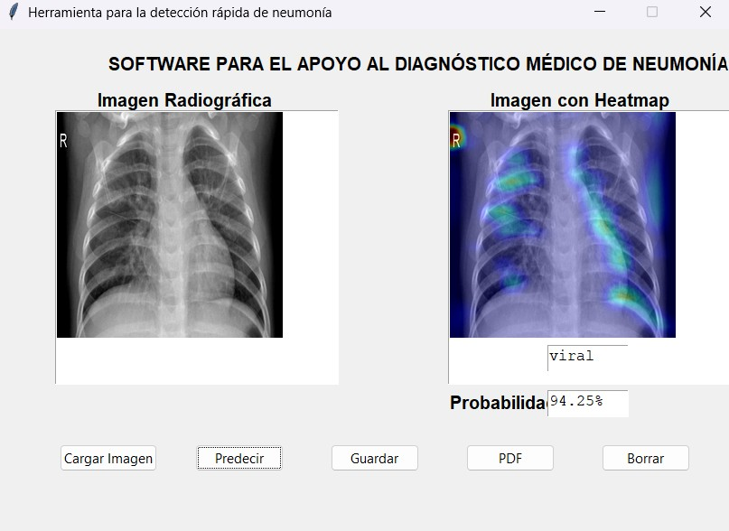

# Pneumonia-Detection-AI

Herramienta para el apoyo al diagnóstico médico de neumonía a partir de radiografías de tórax utilizando Deep Learning y Grad-CAM.

Este proyecto fue desarrollado en el marco del curso **Desarrollo de Proyectos de Inteligencia Artificial**, donde se realizó la refactorización de un repositorio existente aplicando principios de ingeniería de software como **alta cohesión, bajo acoplamiento y modularidad**.

---

# Descripción del Proyecto

El sistema permite analizar radiografías de tórax y clasificarlas en tres categorías:

- Neumonía bacteriana
- Neumonía viral
- Normal

Para mejorar la interpretabilidad del modelo se utiliza **Grad-CAM**, una técnica que genera mapas de calor que muestran las regiones de la imagen utilizadas por el modelo para tomar la decisión.

---

# Arquitectura del Proyecto

El proyecto está organizado en módulos independientes para separar la carga del modelo, el preprocesamiento de imágenes, la inferencia, la generación de Grad-CAM y la aplicación principal.

```text
UAO-Neumonia/
├── data/
│   └── raw/
├── models/
│   └── conv_MLP_84.h5
├── src/
│   ├── app.py
│   ├── check_model.py
│   ├── detector_neumonia.py
│   ├── grad_cam.py
│   ├── integrator.py
│   ├── load_model.py
│   ├── preprocess_img.py
│   └── read_img.py
├── tests/
├── Dockerfile
├── Makefile
├── pytest.ini
├── requirements.txt
├── README.md
└── .gitignore
```

# Flujo del Sistema

El pipeline de inferencia funciona de la siguiente manera:

1. Carga de imagen (DICOM o JPEG)
2. Lectura de imagen (`read_img.py`)
3. Preprocesamiento (`preprocess_img.py`)
4. Carga del modelo (`load_model.py`)
5. Predicción del modelo CNN
6. Generación del mapa de calor (`grad_cam.py`)
7. Integración del pipeline (`integrator.py`)
8. Visualización de resultados en la interfaz

---

# Principios de Ingeniería Aplicados

## Alta cohesión

Cada módulo del sistema tiene una única responsabilidad clara:

- `read_img.py` → lectura de imágenes
- `preprocess_img.py` → preprocesamiento
- `load_model.py` → carga del modelo
- `grad_cam.py` → generación de heatmap
- `integrator.py` → integración del pipeline

## Bajo acoplamiento

La interfaz gráfica no contiene lógica de predicción ni preprocesamiento.  
Toda la lógica del sistema se encuentra desacoplada en módulos dentro de `src`.

---

# Tecnologías Utilizadas

- Python 3.12
- TensorFlow
- OpenCV
- NumPy
- Matplotlib
- pydicom
- Pillow
- pytest
- Docker

---

# Instalación

## Crear entorno virtual

En Windows PowerShell:

|||python -m venv .venv
.\.venv\Scripts\activate

## Instalar dependencias
pip install -r requirements.txt

## Ejecución del Proyecto
Ejecutar predicción desde consola
python app.py

Salida esperada:

RESULTADO DEL MODELO

Clase predicha: viral
Probabilidad: 94.25%

## Ejecutar interfaz gráfica
python detector_neumonia.py

La interfaz permite:

- cargar imagen
- realizar predicción
- visualizar heatmap Grad-CAM
- guardar resultados

## Pruebas Unitarias
El proyecto incluye pruebas unitarias con pytest.

Ejecutar:
python -m pytest -v

Resultado esperado:
3 passed

## Docker
Construir imagen
docker build -t uaoneumonia .

Ejecutar contenedor
docker run uaoneumonia

# Resultados

El sistema genera:

- clase predicha
- probabilidad del modelo
- mapa de calor Grad-CAM

Esto permite visualizar qué regiones de la radiografía influyeron en la decisión del modelo.

## Ejemplo de ejecución

La siguiente imagen muestra la interfaz del sistema realizando una predicción sobre una radiografía de tórax.



# Notas

- El archivo del modelo .h5 no se sube al repositorio y se ignora mediante .gitignore.
- Los datos de prueba tampoco se incluyen en el repositorio.

# Autor

- Julián David López Ramos

# Licencia

Este proyecto se distribuye bajo la licencia MIT.
Para más información ver el archivo `LICENSE`.
